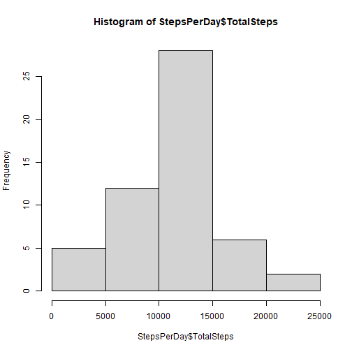
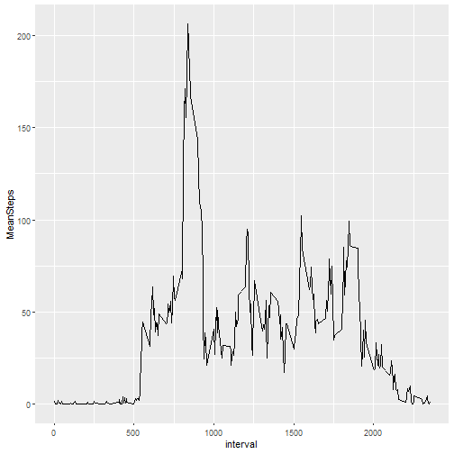
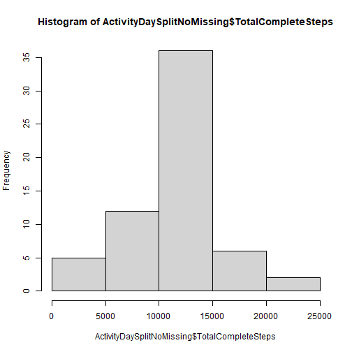
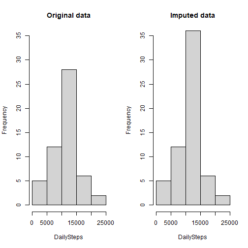
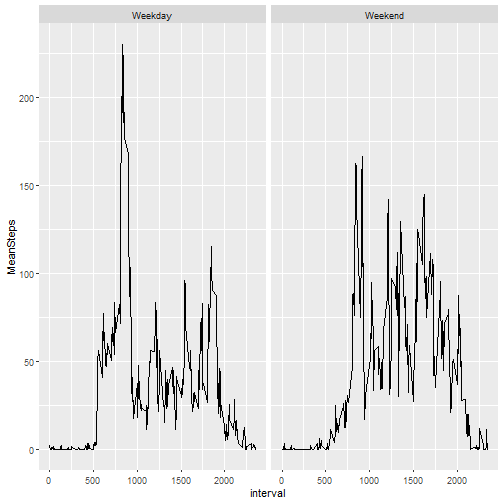

# Rmarkdown document for Course Project 1 of the Reproducible Research course.

## Set global options

```r
## Set global options
knitr::opts_chunk$set(echo = TRUE, cache = TRUE)
```

## Load packages

```r
## Load packages
library(lubridate)
library(tidyverse)
library(knitr)
```

## Loading and preprocessing the data


```r
## Read in data
Activity <- read.csv(unzip("activity.zip"), header = TRUE, sep = ",")

## Convert date variable to date format
Activity$date <- ymd(Activity$date)
```


## What is mean total number of steps taken per day?
### 1. Calculate the total number of steps taken per day

```r
## Group data by day
ActivityDaySplit <-
    Activity %>%
        group_by(date)

## Total steps per day
StepsPerDay <- 
    ActivityDaySplit %>%
        summarise(TotalSteps = sum(steps))
## Print
StepsPerDay
```

```
## # A tibble: 61 x 2
##    date       TotalSteps
##    <date>          <int>
##  1 2012-10-01         NA
##  2 2012-10-02        126
##  3 2012-10-03      11352
##  4 2012-10-04      12116
##  5 2012-10-05      13294
##  6 2012-10-06      15420
##  7 2012-10-07      11015
##  8 2012-10-08         NA
##  9 2012-10-09      12811
## 10 2012-10-10       9900
## # ... with 51 more rows
```

### 2. If you do not understand the difference between a histogram and a barplot, research the difference between them. Make a histogram of the total number of steps taken each day


```r
## Histogram for total steps per day
hist(StepsPerDay$TotalSteps)
```



### 3. Calculate and report the mean and median of the total number of steps taken per day

```r
## Mean and median of total steps per day
print(OriginalSummary <- summary(StepsPerDay$TotalSteps))
```

```
##    Min. 1st Qu.  Median    Mean 3rd Qu.    Max.    NA's 
##      41    8841   10765   10766   13294   21194       8
```

## What is the average daily activity pattern?
### 1. Make a time series plot (i.e. type = "l") of the 5-minute interval (x-axis) and the average number of steps taken, averaged across all days (y-axis)


```r
## Group by interval
ActivityIntervalSplit <- 
    Activity %>%
        group_by(interval) %>%
            summarise(MeanSteps = mean(steps, na.rm = TRUE))

## Time series plot of 5-minute interval vs average steps
with(ActivityIntervalSplit,
    qplot(interval, MeanSteps, geom = "line")
)
```



### 2. Which 5-minute interval, on average across all the days in the dataset, contains the maximum number of steps?

```r
## Sort grouped table by mean number of steps (to show highest)
print(ActivityIntervalSplitSorted <- 
        ActivityIntervalSplit %>%
         arrange(desc(MeanSteps))
      )
```

```
## # A tibble: 288 x 2
##    interval MeanSteps
##       <int>     <dbl>
##  1      835      206.
##  2      840      196.
##  3      850      183.
##  4      845      180.
##  5      830      177.
##  6      820      171.
##  7      855      167.
##  8      815      158.
##  9      825      155.
## 10      900      143.
## # ... with 278 more rows
```

```r
## Print 5-minute interval with highest mean steps value
ActivityIntervalSplitSorted$interval[1]
```

```
## [1] 835
```


## Imputing missing values
### 1. Calculate and report the total number of missing values in the dataset (i.e. the total number of rows with NAs)


```r
## Total number of rows
print(ActivityRows <- nrow(Activity))
```

```
## [1] 17568
```

```r
## Number of rows with missing values
print(ActivityNA <- sum(!complete.cases(Activity)))
```

```
## [1] 2304
```

```r
## Proportion missing
print(ActivityNAprop <- ActivityNA / ActivityRows)
```

```
## [1] 0.1311475
```

### 2. Devise a strategy for filling in all of the missing values in the dataset. The strategy does not need to be sophisticated. For example, you could use the mean/median for that day, or the mean for that 5-minute interval, etc.
### 3. Create a new dataset that is equal to the original dataset but with the missing data filled in.


```r
## Count number of days
NoDays <- length(unique(Activity$date))

## Create vector with mean number of steps per 5-minute interval, repeated by the number of days
## Therefore making the vector length the same as the lenth of the original dataset
MeanStepsRepeat <- rep(ActivityIntervalSplit$MeanSteps, NoDays)

## Check lengths match
ActivityRows == length(MeanStepsRepeat)
```

```
## [1] TRUE
```

```r
## Append new vector to dataset
ActivityToImpute <- 
    cbind(Activity, MeanStepsRepeat)

## Create new variable with either original value or imputed one if it is NA
ActivityNoMissing <- 
    ActivityToImpute %>%
        mutate(StepsComplete = case_when(is.na(steps) ~ MeanStepsRepeat,
                                         !is.na(steps) ~ as.numeric(steps),
                                         TRUE ~ NA_real_)
               )
```

### 4. Make a histogram of the total number of steps taken each day and Calculate and report the mean and median total number of steps taken per day. Do these values differ from the estimates from the first part of the assignment? What is the impact of imputing missing data on the estimates of the total daily number of steps?


```r
## Below the same as first task but using imputed dataset with no NA values
## Group data by day
ActivityDaySplitNoMissing <-
    ActivityNoMissing %>%
        group_by(date) %>%
            summarise(TotalCompleteSteps = sum(StepsComplete))


## Histogram for total steps per day 
hist(ActivityDaySplitNoMissing$TotalCompleteSteps)
```




```r
## Mean and median of total steps per day
print(ImputedSummary <- summary(ActivityDaySplitNoMissing$TotalCompleteSteps))
```

```
##    Min. 1st Qu.  Median    Mean 3rd Qu.    Max. 
##      41    9819   10766   10766   12811   21194
```


```r
## Investigating differences in summary statistics
# Original (with NAs)
print("Original (with NAs)")
```

```
## [1] "Original (with NAs)"
```

```r
print(OriginalSummary)
```

```
##    Min. 1st Qu.  Median    Mean 3rd Qu.    Max.    NA's 
##      41    8841   10765   10766   13294   21194       8
```

```r
# Imputed (without NAs)
print("Imputed (without NAs)")
```

```
## [1] "Imputed (without NAs)"
```

```r
print(ImputedSummary)
```

```
##    Min. 1st Qu.  Median    Mean 3rd Qu.    Max. 
##      41    9819   10766   10766   12811   21194
```


```r
## Compare original and imputed plot

# Set up panels
par(mfrow=c(1,2))

# Original
hist(StepsPerDay$TotalSteps,
     main = "Original data",
     xlab = "DailySteps",
     ylim = c(0,35))
# Imputed
hist(ActivityDaySplitNoMissing$TotalCompleteSteps,
     main = "Imputed data",
     xlab = "DailySteps",
     ylim = c(0,35))
```



### Findings
The mean, median and range have remained the same between the two tasks. 
However, the imputed data has a greater frequency of observations in the central bin, 
which makes sense given that the imputed data was calculated using the means.


## Are there differences in activity patterns between weekdays and weekends?
### 1. Create a new factor variable in the dataset with two levels – “weekday” and “weekend” indicating whether a given date is a weekday or weekend day.


```r
## Create clean version of data
ActivityClean <-
    ActivityNoMissing %>%
        select(-steps, -MeanStepsRepeat)

## Rename steps
ActivityClean <- 
    ActivityClean %>%
        rename(steps = StepsComplete)

## Create WeekdayBinary
ActivityClean <- 
    ActivityClean %>%
        mutate(WeekdayBinary =
                   factor(
                       grepl("S(at|un)", weekdays(date)),
                       levels = c(FALSE, TRUE),
                       labels = c("Weekday", "Weekend")
                   )
                )
```

### 2. Make a panel plot containing a time series plot (i.e. type = "l") of the 5-minute interval (x-axis) and the average number of steps taken, averaged across all weekday days or weekend days (y-axis).


```r
## Group by interval
ActivityCleanIntervalSplit <- 
    ActivityClean %>%
        group_by(interval, WeekdayBinary) %>%
            summarise(MeanSteps = mean(steps, na.rm = TRUE))
```

```
## `summarise()` has grouped output by 'interval'. You can override using the `.groups` argument.
```

```r
## Time series plot of 5-minute interval vs average steps, for weekday vs weekend
## Build core
CorePlot <- ggplot(ActivityCleanIntervalSplit, 
                   mapping = 
                       aes(interval, MeanSteps))

## Build plot
CorePlot + geom_line() + facet_grid(. ~ WeekdayBinary)
```




